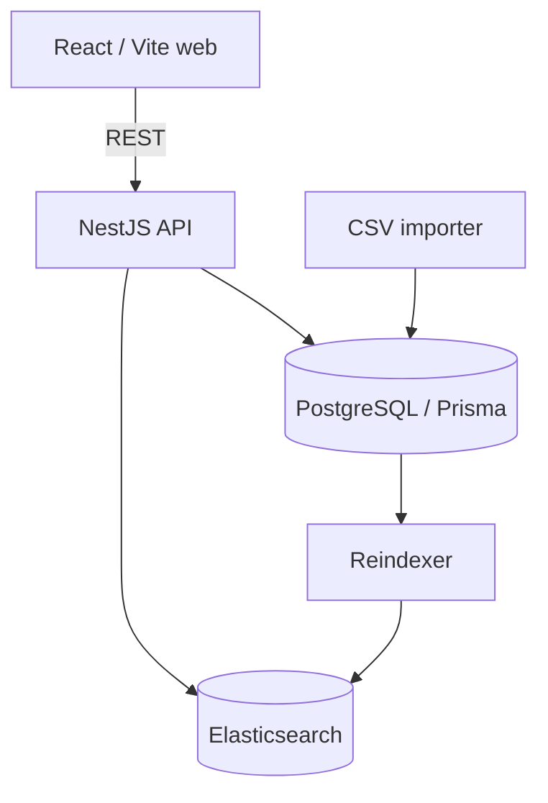

# LinkedIn Profile Search

## Project Overview

A local technical-assignment application for importing a supplied profile CSV, searching approved professional fields, and viewing aggregate analytics. It is deliberately not an identity, authentication, or profile-enrichment product.

## Architecture



PostgreSQL is the durable source of truth. Import normalizes and writes profiles there; reindex reads PostgreSQL and safely replaces the Elasticsearch alias. Elasticsearch is a derived read/search index. The frontend never accesses either store directly. `packages/shared` contains transport contracts used by both applications.

## Tech Stack

Node.js 22, pnpm 9, TypeScript, NestJS, Prisma/PostgreSQL 16, Elasticsearch 8.19, React/Vite, Material UI, TanStack Query, Jest, Vitest, Docker Compose, ESLint, and Prettier.

## Prerequisites

Node 22, pnpm 9, Docker Compose, and Make are required. Docker needs enough memory for Elasticsearch (the local container is configured for a 512 MB heap).

## Getting Started

Place the supplied dataset exactly at `data/raw/300-user-linkedin.csv`, then run:

```bash
cp .env.example .env
pnpm install
make setup
make dev
```

`make setup` checks the dataset, starts healthy PostgreSQL and Elasticsearch, applies committed migrations, imports idempotently, rebuilds the search index, and prints only aggregate count status. It exits non-zero on any failure. It never prints raw rows. The direct pnpm equivalent is `pnpm run setup` (`pnpm setup` is a reserved pnpm installer command).

## Local Development

`make infra-up` starts only PostgreSQL and Elasticsearch. `make dev` starts that infrastructure plus host watch processes. After setup:

- Frontend: `http://localhost:5173`
- API: `http://localhost:3000/api`
- Swagger: `http://localhost:3000/api/docs`
- Search: `http://localhost:5173/search`
- Analytics: `http://localhost:5173/analytics`

Use `POSTGRES_PORT`, `ELASTICSEARCH_PORT`, `API_PORT`, and `WEB_PORT` for host-port conflicts. If `WEB_PORT` changes, set `WEB_ORIGIN` to its matching browser origin. Host development connects to `localhost`; containers connect to `postgres` and `elasticsearch` service names.

## Docker Development

Run host initialization first (the raw dataset is intentionally never copied into an image):

```bash
cp .env.example .env
pnpm install
make setup
make docker-up
```

`make docker-up` builds and waits for `postgres`, `elasticsearch`, `api`, and `web`. The web container proxies `/api` internally to the API, so the Docker browser application is same-origin. `docker compose down` preserves `postgres_data` and `elasticsearch_data`; `docker compose down -v` deletes them and is intentionally never run automatically.

## Environment Variables

All runtime configuration is validated by the API environment schema. `.env.example` has local-only defaults, not production secrets.

| Variable                                                               | Purpose                                                |
| ---------------------------------------------------------------------- | ------------------------------------------------------ |
| `NODE_ENV`, `API_PORT`                                                 | API mode and host API port                             |
| `WEB_ORIGIN`, `VITE_API_BASE_URL`                                      | allowed browser origin and host web API URL            |
| `POSTGRES_DB`, `POSTGRES_USER`, `POSTGRES_PASSWORD`, `POSTGRES_PORT`   | local PostgreSQL container configuration and host port |
| `DATABASE_URL`                                                         | host Prisma connection URL (`localhost`)               |
| `ELASTICSEARCH_URL`, `ELASTICSEARCH_PORT`, `ELASTICSEARCH_INDEX_ALIAS` | host search URL/port and stable alias                  |
| `REQUEST_SIZE_LIMIT`                                                   | JSON and URL-encoded body limit (default `100kb`)      |
| `RATE_LIMIT_MAX`, `RATE_LIMIT_WINDOW_MS`                               | in-memory request limit and window                     |
| `WEB_PORT`                                                             | optional Docker web host port (defaults to `5173`)     |

Compose constructs its own internal database URL with `postgres` and sets Elasticsearch to `http://elasticsearch:9200`; it does not reuse host `localhost` URLs inside containers.

## Dataset Placement and Privacy

The source file must be `data/raw/300-user-linkedin.csv`. `data/raw/*` and generated `data/processed/*` data are ignored while their `.gitkeep` files remain tracked. The Docker context excludes both directories; no raw data is mounted or embedded in the normal stack.

Phone/mobile numbers, email, addresses/street/postal data, birth information, unrelated social identifiers, source keys, internal LinkedIn identifiers, raw rows, and import diagnostics are excluded. The database whitelist, Elasticsearch mapping, and API response mapper each permit only approved professional fields. Tests and documentation use synthetic fixtures only.

## Database Migration

```bash
pnpm db:migrate:deploy
# development-only migration creation: pnpm db:migrate
```

## Importing the Dataset

```bash
pnpm data:inspect
pnpm data:import -- --dry-run
pnpm data:import
```

The import is idempotent and reports aggregates only. A missing dataset returns a clear failure rather than silently creating an empty database.

## Elasticsearch Architecture

```bash
pnpm search:reindex
pnpm search:index:status
```

Reindexing creates and populates a versioned physical index from PostgreSQL, verifies its count, then switches the configured alias. It is not a direct CSV index. `search:index:status` reports PostgreSQL and Elasticsearch counts; after importing the supplied dataset, both should be `248`.

## Search API

```http
GET /api/health
GET /api/profiles/search?q=engineer&skills=TypeScript,SQL&jobTitle=Engineer&page=1&limit=20
GET /api/profiles/analytics
```

`q` and `jobTitle` are strings; `skills` is comma-separated and uses AND semantics; `page` starts at 1; `limit` is 1–50 (default 20). Invalid or unknown query parameters return a safe 400. Elasticsearch outages return a generic 503, not connection details. Swagger is available at `/api/docs`.

## Analytics API

`GET /api/profiles/analytics` returns aggregate totals and top industry, skill, and country buckets only. It never returns profile documents or raw Elasticsearch responses.

## Swagger

At runtime, open `http://localhost:3000/api/docs` (or the configured API port) for the generated OpenAPI documentation.

## Makefile Commands

Run `make help` for the concise command list. Important targets are `setup`, `infra-up`, `infra-down`, `dev`, `dev-api`, `dev-web`, `docker-up`, `docker-down`, `docker-build`, `logs`, `ps`, `migrate`, `data-import`, `search-reindex`, `test`, `lint`, `typecheck`, `build`, and `check`. Root pnpm equivalents include `pnpm infra:up`, `pnpm infra:down`, `pnpm run setup`, `pnpm db:migrate:deploy`, `pnpm data:import`, `pnpm search:reindex`, and `pnpm check`.

## Testing and Quality

```bash
pnpm format:check
pnpm lint
pnpm typecheck
pnpm test
pnpm build
# or: make check
```

The API suite includes in-memory HTTP integration tests; it does not need Docker, PostgreSQL, Elasticsearch, or real dataset values.

## Security Decisions

The API uses Helmet, configured-origin CORS, strict DTO validation with unknown-query rejection, pagination/query limits, a 100 KB request-size limit, in-memory rate limiting, safe 503 errors, environment validation, and response whitelists. Raw data is never served. In-memory rate limiting fits this single-instance assignment; horizontally scaled production would need shared rate-limit storage.

## Data Privacy

Raw data is untracked, excluded from Docker builds, and is not logged. Only the professional whitelist is normalized, persisted, indexed, and returned. No examples, tests, or reports contain real profile values.

## Architecture Decisions

- **PostgreSQL and Elasticsearch:** PostgreSQL provides durable relational storage and deterministic imports; Elasticsearch provides full-text search, filtering, relevance, and aggregations.
- **React/Vite instead of Next.js:** this is an authentication-free client-side search application with no SSR or SEO requirement, so Vite is simpler.
- **No Redis:** the dataset and expected request volume do not justify another stateful service. Elasticsearch search behavior and TanStack Query client caching are sufficient here; Elasticsearch is not treated as a general application cache.
- **Personal-data exclusion:** unnecessary personal information is rejected, while explicitly whitelisted professional fields are retained.
- **URL-driven search state:** URLs survive refreshes, are shareable, work with browser navigation, and avoid unnecessary global state.

## Trade-offs

Compose disables Elasticsearch security only for local review. The stack uses persistent local volumes and one API instance; production would require secret management, Elasticsearch security, backup/retention policies, and shared rate-limit storage.

## Troubleshooting

- **Port 5432 or 9200 busy:** change `POSTGRES_PORT` or `ELASTICSEARCH_PORT` in `.env`, then rerun `make infra-up`.
- **Elasticsearch fails to start:** allocate more Docker memory, then inspect `make logs` or `docker compose logs elasticsearch`.
- **Dataset missing:** put the supplied file at `data/raw/300-user-linkedin.csv`; `make setup` names the missing path.
- **Migration failure:** confirm `make ps` reports PostgreSQL healthy, then rerun `make migrate`.
- **Empty search or count mismatch:** run `make search-reindex`, then `pnpm search:index:status`.
- **CORS error during host development:** ensure `WEB_ORIGIN` exactly matches the Vite origin and restart the API.
- **Stale Docker images:** run `make docker-build` followed by `make docker-up`; do not delete volumes as a first troubleshooting step.
- **Health and logs:** use `make ps` and `make logs`.

## Future Improvements

Production deployment would add secret management, authenticated Elasticsearch, shared rate-limit storage, backup policies, and further web bundle splitting. The current Vite build retains its main-chunk advisory intentionally rather than hiding it.
