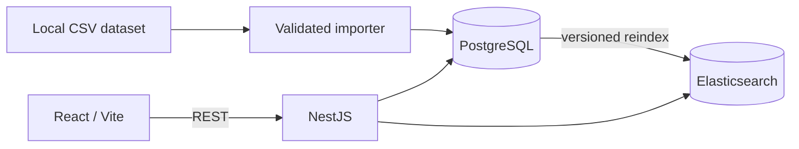

# LinkedIn Profile Search

A local full-stack application that imports a supplied LinkedIn profile dataset, searches approved professional fields, applies filters, and presents aggregate analytics.

## Architecture



PostgreSQL is the durable source of truth. Elasticsearch is a derived search index that is replaced safely through an alias. The frontend communicates through the API, and `packages/shared` contains the transport contracts shared by both applications.

The project uses Node.js 22, pnpm 9, TypeScript, NestJS, Prisma, PostgreSQL 16, Elasticsearch 8.19, React, Vite, Material UI, TanStack Query, Jest, Vitest, and Docker Compose.

## Prerequisites

- Node.js 22
- pnpm 9
- Docker with Docker Compose
- Make
- At least 512 MB of Docker memory available for Elasticsearch

## Dataset setup

The application expects the supplied dataset at this exact path:

```text
data/raw/300-user-linkedin.csv
```

If the supplied file has a `.txt` extension but contains comma-separated data, rename it; its contents do not need to be converted:

```bash
mv data/raw/300-user-linkedin.txt data/raw/300-user-linkedin.csv
```

The real dataset is intentionally not committed. `data/raw/*` is ignored by Git because profile exports may contain personal or sensitive information. Only `data/raw/.gitkeep` is tracked to preserve the directory.

Automated tests do not need the real dataset or running infrastructure. They create synthetic fixtures at runtime, so contributors can run the quality checks without copying the supplied data into the repository.

### Why the import pipeline is needed

The supplied export is treated as untrusted input because real-world profile data can contain malformed rows, inconsistent formatting, missing identity fields, unsupported layouts, invalid public values, and duplicate profiles. The pipeline handles these problems before any profile becomes searchable:

- Rows with the wrong number of columns and unsupported or ambiguous layouts are skipped.
- Whitespace, LinkedIn URLs and identifiers, dates, countries, skills, experience, and education are normalized into the application's approved professional-field schema.
- Records without enough stable identity information are rejected.
- Duplicate profiles within an import are detected using a hashed stable source key and skipped.
- Repeated imports safely create, update, or leave existing profiles unchanged instead of creating duplicate database records.
- Import and audit reports contain aggregate counts, warning codes, and rejection reasons without exposing source rows.
- Only accepted public fields are stored in PostgreSQL and copied into the Elasticsearch search index.

Use `pnpm data:inspect` to examine the CSV structure, `pnpm data:audit` to validate normalized profile quality, or `pnpm data:import -- --dry-run` to preview an import without writing profiles.

## Quick start

After placing the dataset at the required path, run:

```bash
make setup
make dev
```

`make setup` installs locked dependencies, creates `.env` from `.env.example` when needed, validates the dataset, starts PostgreSQL and Elasticsearch, applies migrations, imports profiles idempotently, rebuilds the search index, and verifies record counts. It exits on failure and never prints source rows.

Open the application and supporting endpoints at:

- Search: <http://localhost:5173/search>
- Analytics: <http://localhost:5173/analytics>
- API: <http://localhost:3000/api>
- Swagger documentation: <http://localhost:3000/api/docs>

For a fully containerized API and web runtime, initialize the data first and then start the complete stack:

```bash
make setup
make docker-up
```

`make setup` is required on a fresh clone and after deleting Docker volumes: it imports the dataset and rebuilds the Elasticsearch `profiles` index. `make docker-up` builds and starts the API and web containers, but does not import data or create the search index by itself.

For normal restarts, use:

```bash
make docker-down
make docker-up
```

The web container serves the application through Nginx and proxies `/api` to the API container. `make docker-down` stops the stack while preserving database and search volumes. Do not use `docker compose down -v` unless you intend to erase the local database and search index; if you do, run `make setup` again before `make docker-up`.

## Search API

```http
GET /api/health
GET /api/profiles/search?q=engineer&skills=TypeScript,SQL&jobTitle=Engineer&industry=Technology&page=1&limit=10
GET /api/profiles/analytics
```

Search behavior:

- `q` searches names, top-level professional fields, skills, and safe structured experience titles and company names. Every entered word is required. Exact phrases rank highest, full-token matches rank above intentional final-word prefixes, and conservative fuzziness applies only when every term is longer than three characters.
- `skills` accepts up to ten comma-separated values. Values are normalized and deduplicated, exact skill terms are matched case-insensitively, and multiple skills use AND semantics.
- `jobTitle` matches either the reliable top-level title or a safe structured experience title. Matching is case-insensitive, requires every word, and allows the final word to be an intentional prefix.
- `industry` is case-insensitive, whitespace-normalized, requires every word, and allows the final word to be an intentional prefix. Source profiles without a reliable industry remain blank rather than receiving a guessed value.
- `page` starts at `1`.
- `limit` defaults to `10` and cannot exceed `10`.
- Invalid or unknown parameters return `400`; search outages return a generic `503` response.

## Common commands

Run `make help` to see every supported workflow.

```bash
make install       # Install dependencies from the lockfile
make setup         # Prepare infrastructure and import the dataset
make dev           # Start the API and web development servers
make test          # Run API and frontend tests
make check         # Run formatting, linting, types, tests, and builds
make clean         # Remove dependencies and generated artifacts
make logs          # Follow Docker Compose logs
make docker-down   # Stop containers and preserve named volumes
```

`make clean` recursively removes `node_modules`, build outputs, coverage, tool caches, TypeScript build metadata, logs, and temporary editor files. It does not delete source files, `.env`, the raw dataset, generated data reports, or Docker volumes. Run `make install` afterward to restore dependencies.

Useful data and search commands:

```bash
pnpm data:inspect
pnpm data:audit
pnpm data:import -- --dry-run
pnpm data:import
pnpm data:rebuild       # Guarded, local-only destructive rebuild
pnpm search:reindex
pnpm search:index:status
```

Imports normalize a strict professional-field whitelist and upsert profiles by a hashed, stable source key. Reindexing creates a versioned physical index, verifies its count and public fields, and only then switches the configured alias. PostgreSQL and Elasticsearch counts must match the accepted-profile count reported by `pnpm data:audit`.

## Testing and quality

Run the complete project checks with:

```bash
make check
```

This checks formatting, runs ESLint and TypeScript, executes API and frontend tests, and creates production builds. API tests cover the configured HTTP boundary and use synthetic data rather than the real LinkedIn export.

The API also uses Helmet, configured-origin CORS, strict DTO validation, query and pagination limits, a 100 KB request-body limit, rate limiting, validated environment configuration, and explicit public-response mappers.

## Configuration and troubleshooting

Local defaults are documented in `.env.example`. Common settings include `API_PORT`, `WEB_ORIGIN`, `DATABASE_URL`, `ELASTICSEARCH_URL`, `ELASTICSEARCH_INDEX_ALIAS`, `POSTGRES_PORT`, `ELASTICSEARCH_PORT`, `REQUEST_SIZE_LIMIT`, `RATE_LIMIT_MAX`, and `RATE_LIMIT_WINDOW_MS`.

- **Dataset missing:** confirm the filename is exactly `data/raw/300-user-linkedin.csv`; rename a CSV-formatted `.txt` file if necessary.
- **Port conflict:** change the corresponding port in `.env`. If the web origin changes, update `WEB_ORIGIN` to match it.
- **Database authentication failure after changing credentials:** an existing PostgreSQL volume retains the credentials from its first initialization. Restore those credentials or recreate the disposable local volume and rerun setup.
- **Elasticsearch startup failure:** allocate more Docker memory and inspect `make logs`.
- **Empty or mismatched search index:** run `make setup` after a fresh clone or deleted Docker volumes. Otherwise, run `pnpm search:reindex`, followed by `pnpm search:index:status`.
- **CORS failure during host development:** make `WEB_ORIGIN` match the browser origin and restart the API.

This setup is intended for local development. Production deployment would additionally require secret management, Elasticsearch authentication, backups and retention policies, and shared rate-limit storage when running multiple API instances.
