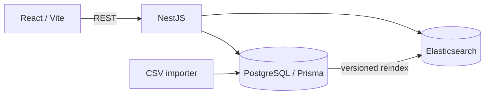

# LinkedIn Profile Search

A local full-stack application for importing the supplied LinkedIn profile CSV, searching approved professional fields, filtering results, and viewing aggregate analytics.

## Architecture



PostgreSQL is the durable source of truth. Elasticsearch is a derived search index replaced safely through an alias. The frontend accesses both through the API, and `packages/shared` contains the transport contracts used by the two applications.

Stack: Node.js 22, pnpm 9, TypeScript, NestJS, Prisma/PostgreSQL 16, Elasticsearch 8.19, React/Vite, Material UI, TanStack Query, Jest, Vitest, and Docker Compose.

## Run locally

Prerequisites: Node 22, pnpm 9, Docker Compose, Make, and enough Docker memory for Elasticsearch's 512 MB heap.

Place the dataset at `data/raw/300-user-linkedin.csv`, then run:

```bash
cp .env.example .env
pnpm install
make setup
make dev
```

`make setup` validates the dataset, starts PostgreSQL and Elasticsearch, applies migrations, imports profiles idempotently, rebuilds the search index, and verifies counts. It exits on failure and never prints source rows.

- Web: `http://localhost:5173/search`
- API: `http://localhost:3000/api`
- Swagger: `http://localhost:3000/api/docs`
- Analytics: `http://localhost:5173/analytics`

For a fully containerized runtime after setup:

```bash
make docker-up
```

The web container serves the application through Nginx and proxies `/api` to the API container. `make docker-down` preserves the database and search volumes.

## Search and data

```http
GET /api/health
GET /api/profiles/search?q=engineer&skills=TypeScript,SQL&jobTitle=Engineer&industry=Technology&page=1&limit=10
GET /api/profiles/analytics
```

- `q` searches names, titles, companies, skills, industries, locations, countries, and summaries. Every entered word is required; exact phrases rank highest, selected fields support prefixes, and fuzzy matching starts with terms longer than three characters.
- `skills` is comma-separated and uses AND semantics.
- `jobTitle` is a partial, case-insensitive title filter.
- `industry` is a partial, case-insensitive industry filter.
- `page` starts at 1; `limit` defaults to 10 and cannot exceed 10.
- Invalid or unknown parameters return 400. Search outages return a generic 503.

Useful data commands:

```bash
pnpm data:inspect
pnpm data:audit
pnpm data:import -- --dry-run
pnpm data:import
pnpm data:rebuild       # guarded local-only destructive rebuild
pnpm search:reindex
pnpm search:index:status
```

Imports normalize a strict professional-field whitelist and upsert profiles by a hashed stable source key. Reindexing creates a versioned physical index, checks its count and public fields, and only then switches the configured alias. PostgreSQL and Elasticsearch counts must match the accepted-profile count from `pnpm data:audit`.

The raw dataset, generated reports, and `.env` are ignored by Git. They are also excluded from Docker build contexts. Phone numbers, email, addresses, birth information, unrelated social identifiers, source keys, internal LinkedIn identifiers, raw rows, and import diagnostics are never returned publicly.

## Quality

```bash
pnpm check
```

This runs formatting, linting, type checking, API and frontend tests, and production builds. API tests include the configured HTTP boundary; fixtures are synthetic and do not require the real dataset or infrastructure.

The API also applies Helmet, configured-origin CORS, strict DTO validation, query and pagination limits, a 100 KB body limit, rate limiting, validated environment configuration, and explicit response mappers.

## Configuration and operations

Local defaults are documented in `.env.example`. Common variables are `API_PORT`, `WEB_PORT`, `WEB_ORIGIN`, `DATABASE_URL`, `ELASTICSEARCH_URL`, `ELASTICSEARCH_INDEX_ALIAS`, `POSTGRES_PORT`, `ELASTICSEARCH_PORT`, `REQUEST_SIZE_LIMIT`, `RATE_LIMIT_MAX`, and `RATE_LIMIT_WINDOW_MS`.

Run `make help` for all operational commands. Common troubleshooting steps:

- Port conflict: change the corresponding port in `.env`; when changing `WEB_PORT`, update `WEB_ORIGIN` too.
- Database authentication after changing credentials: an existing PostgreSQL volume keeps the password from its first initialization. Restore that password, or recreate the disposable local volume and rerun setup.
- Elasticsearch startup failure: allocate more Docker memory and inspect `make logs`.
- Empty or mismatched search index: run `pnpm search:reindex`, then `pnpm search:index:status`.
- CORS failure in host development: make `WEB_ORIGIN` match the browser origin and restart the API.

This setup is intentionally local. A production deployment would require secret management, Elasticsearch authentication, backups and retention policies, and shared rate-limit storage for multiple API instances.
